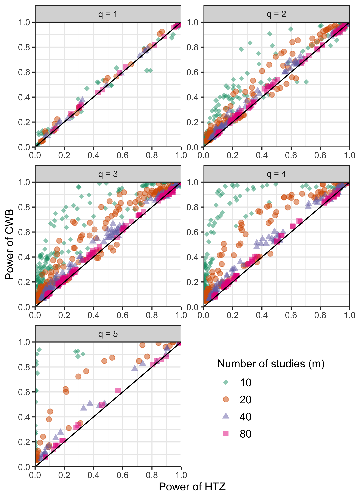

```{r xaringan-themer, include=FALSE, warning=FALSE}
library(xaringanthemer)
style_mono_accent(
  base_color = "#3C989E",
  header_font_google = google_font("Josefin Sans"),
  text_font_google   = google_font("Montserrat", "300", "300i"),
  code_font_google   = google_font("Fira Mono")
)

library(tidyverse)
library(knitr)
library(kableExtra)
library(simhelpers)
```

# About Me

- PhD in Quantitative Methods at UT Austin (2021)

- Research interests
  - Causal inference 
  - Meta-analysis
  
- Article based on my dissertation, which focused on examining methods to handle dependent effect sizes in meta-analysis

  -  [Preprint](https://osf.io/preprints/metaarxiv/x6uhk/)

  - Co-authors: [James E. Pustejovsky](https://www.jepusto.com/) and [S. Natasha Beretvas](https://education.utexas.edu/faculty/susan_beretvas)

---


# Meta Analysis

- Set of statistical techniques to synthesize results from multiple studies on the same topic

- Goals of meta-analysis
  - Summarize effect size estimates across studies (inverse variance weighting)
  - Characterize variability in effect sizes ($\tau^2$)
  - Explain the variability in effect sizes (moderator analyses)


---

# Dependence 

- Typical meta-analytic techniques (like meta-regression) involves the assumption that effect sizes are independent 


- However, common for each primary study to yield more than one effect size or studies to be nested in some way creating dependence 
  
- Example: Garrett, Citkowicz, and Williams (2019)

  - Meta-analysis of randomized studies examining the effect of professional learning interventions for teachers on classroom practice
  
  - Included studies with multiple outcomes measured on the same sample 

---

# Handling Dependence

- Ignore dependence - incorrect standard errors, incorrect inference from hypothesis tests

- Standard multivariate methods - require info on covariance between effect sizes - primary studies don't report

- Cluster robust variance estimation (CR0-type CRVE) (Hedges, Tipton, and Johnson, 2010)

  - Rough approximate assumptions about dependence structure - sandwich estimators

  - Only works well when number of studies is large 
  
  - Meta-analysis in social science research typically have smaller number of studies ~ 40
  
  - Small number of studies - CRVE - Type 1 error inflation 
  
  - Meta-analysts can conclude some effect is present when it is actually not
  
  - Example, can conclude teacher professional learning programs are effective for teachers who are older when in reality that effect does not exist 

---

# Small Sample Corrections

- Tipton (2015) and Tipton and Pustejovsky (2015)

- Both recommended a method - HTZ test - CR2 correction method and using the Satterthwaite degrees of freedom (both CR2 and Satterthwaite df account for leverage and imbalance in covariates)

- The recommended method controls Type 1 error rates adequately 

  - But, really low Type 1 error rates especially for __multiple-contrast hypothesis tests__ (Tipton and Pustejovsky, 2015)
  
  - Indicating that the test may have low power

---

# Multiple Contrast Hypothesis Tests

- Are effects same across different levels of a moderator variable?
  
- Garrett, Citkowicz, and Williams (2019)
 - A multiple-contrast hypothesis __could__ test whether effects of teacher professional learning programs on classroom practice differ for teachers teaching in different grade levels: K-5, 6-8, and 9-12?

- If effects differ
  - For example, effects are positive for teachers in elementary and middle schools but null or negative for teachers in high schools
  - Policy implication - re-evaluate the programs for high school teachers and identify ways to make it better or curtail use of program in high schools
  
- HTZ test - miss the difference in effects across grade levels when it actually exists

  
---

# Cluster Wild Bootstrapping (CWB)

- Alternative method - examined in the econometrics literature - not in meta-analytic framework

- Bootstrapping - estimate unknown quantities by re-sampling from original data many times (Boos et al., 2013)
  
- CWB - re-sampling residuals by multiplying them by cluster-level random weights

---

# CWB Algorithm

1. Fit a null model and a full model on the original data

2. Obtain residuals from the null model 

3. Generate an auxiliary random variable that has mean of 0 and variance of 1 and multiply the residuals by the random variable (e.g., Rademacher weights) set to be constant within clusters (CWB)
  - Can also multiply the residuals by CR2 matrices before multiplying by weights (CWB Adjusted)

4.  Obtain new outcome scores by adding the transformed residuals to the predicted values from the null model fit on the original data

5.  Re-estimate the full model with the new calculated outcome scores and obtain the test statistic

6. Repeat steps 3-5 $R$ times. Calculate p-value:

$$p = \frac{1}{R} \sum_{r = 1}^R I\left(F^{(r)} > F\right)$$


---

# Research Question

To what extent does CWB improve upon the current standard test, the HTZ test, in terms of Type I error rates and power? 


---

# Simulation

- Ran two simulations - presenting on Simulation 1

- Compared CWB against the HTZ test in terms of Type 1 error rates and power

- Results
  - CWB maintained Type 1 error rates adequately 
  - And, provided huge gains in power over the standard method, the HTZ test

---

# Results: Type I Error


```{r echo = FALSE, out.height = 500, out.width = 550, fig.align = "center"}
knitr::include_graphics("plots/type1_05.png")
```


---

# Results: Relative Power


```{r echo = FALSE, out.height = 500, out.width = 400, fig.align = "center"}

```


---

# Conclusion

- Dependent effect sizes - common

- Ignore them - incorrect standard errors and inferences

- Use RVE - Type 1 error inflation - false discovery rate high

- Use small sample correction HTZ test - may miss effects that are present

- Use CWB - balances Type 1 error rates and also provides more power than existing corrections

- R package [wildmeta](https://meghapsimatrix.github.io/wildmeta/)


---

class: inverse, middle, center, cobBack

# Questions?

---

class: inverse, middle, center, cobBack

# THANK YOU!

---

class: inverse

# References

Cameron, A. C., Gelbach, J. B., & Miller, D. L. (2008). Bootstrap-Based Improvements for Inference with Clustered Errors. The Review of Economics and Statistics, 47.

Fisher, Z., Tipton, E., & Zhipeng, H. (2017).robumeta: Robust variance meta- regression [R package version 2.0]. R package version 2.0. 

Garrett, R., Citkowicz, M., & Williams, R. (2019). How responsive is a teacher’s classroom practice to intervention? A meta-analysis of randomized field studies. Review of research in education, 43(1), 106-137.

Hedges, L. V., Tipton, E., & Johnson, M. C. (2010). Robust variance estimation in meta-regression with dependent effect size estimates. Research Synthesis Methods, 1(1), 39–65. 


---

class: inverse

# References

McCaffrey, D. F., Bell, R. M., & Botts, C. H. (2001, August). Generalizations of biased reduced linearization. In Proceedings of the Annual Meeting of the American Statistical Association (No. 1994, p. 673).

MacKinnon, J. G., & Webb, M. D. (2017). Wild Bootstrap Inference for Wildly Dif- ferent Cluster Sizes. Journal of Applied Econometrics, 32(2), 233–254. 

MacKinnon, J. G., & White, H. (1985). Some heteroskedasticity-consistent covariance matrix estimators with improved finite sample properties. Journal of econometrics, 29(3), 305-325.


---

class: inverse

# References

Pustejovsky, J. E. (2020). clubSandwich: Cluster-robust (sandwich) variance estimators with small-sample corrections [R package version 0.4.2]. R package version 0.4.2. 

Pustejovsky, J. E., & Tipton, E. (2021). Meta-analysis with Robust Variance Estimation: Expanding the range of working models. Prevention Science, 1-14.

Tipton, E., & Pustejovsky, J. E. (2015). Small-Sample Adjustments for Tests of Moderators and Model Fit Using Robust Variance Estimation in Meta-Regression. Journal of Educational and Behavioral Statistics, 40 (6), 604–634. 

Tipton, E. (2015). Small sample adjustments for robust variance estimation with meta-regression. Psychological Methods, 20(3), 375–393. 


