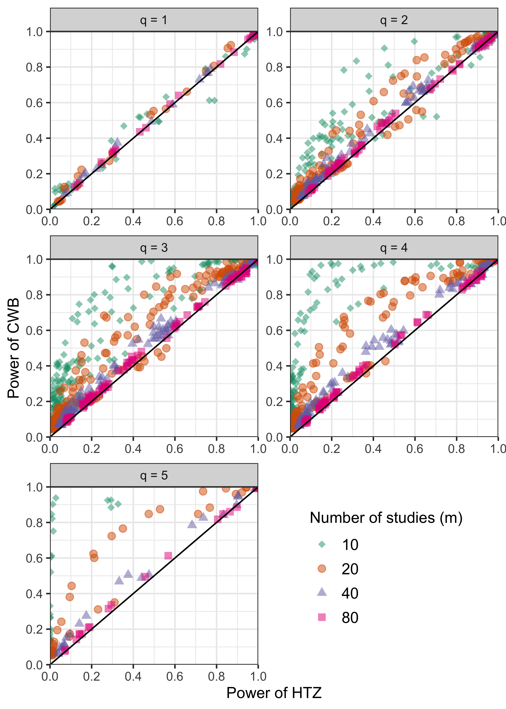

```{r xaringan-themer, include=FALSE, warning=FALSE}
library(xaringanthemer)
style_mono_accent(
  base_color = "#311432",
  header_font_google = google_font("Josefin Sans"),
  text_font_google   = google_font("Montserrat", "300", "300i"),
  code_font_google   = google_font("Fira Mono")
)

library(tidyverse)
library(knitr)
library(kableExtra)
library(simhelpers)
```


# Meta Analysis

- Set of statistical techniques to synthesize results from multiple studies on the same topic

- Goals of meta-analysis
  - Summarize effect size estimates across studies
  - Characterize variability in effect sizes 
  - Explain the variability in effect sizes 


---

# Dependence 

- Typical meta-analytic techniques (like meta-regression) involves the assumption that effect sizes are independent 

- However, common for each primary study to yield more than one effect size or studies to be nested in some way creating dependence 
  
- Example: Tanner-Smith and Lipsey (2015) meta-analysis of the effects of brief alcohol interventions
  - 185 studies, 1446 effect sizes
  - Multiple correlated outcome measures: e.g., alcohol consumption measured by frequency of consumption, quantity consumed, blood alcohol concentration
  - Repeated measures
  - Multiple comparison groups
  
---

# Handling Dependence

- Ignore dependence 
  - Incorrect standard errors, incorrect inference from hypothesis tests
  
- Ad-hoc methods 
  - Selecting one effect per study 
  - Analyzing subsets of data separately 
  - Loss of information

- Standard multivariate methods - ideal 
  - Require info on covariance between effect sizes 
  - Primary studies often don't report 


---

# Robust Variance Estimation

- Robust variance estimation (CR0-type CRVE) (Hedges, Tipton, and Johnson, 2010)

  - Rough approximate assumptions about dependence structure - sandwich estimators

  - Only works well when number of studies is large (> 40, Hedges Tipton, Johnson, 2010)
  
  - Meta-analysis in social science research typically have smaller number of studies
  
  - Small number of studies - CRVE - Type 1 error inflation - meta-analysts can conclude some effect is present when it is actually not
  

---

# Types of Hypothesis Tests

- Test of single coefficients
  - For example: Does the effect of brief alcohol interventions differ according to average age of the sample?

- Multiple-contrast hypothesis tests
  -  Do effects differ across outcome measurements?
  
---

# Implications of Multiple-Contrast Hypothesis Tests

- If effects differ for different outcome measures

  - For example, if brief alcohol interventions reduce quantity consumed but increase frequency consumed; or have no effects on quantity consumed but reduce frequency consumed
  
  - Useful to see if program is having intended effect for outcomes of interest

  
---

# Small Sample Corrections

- Tipton (2015) for tests of single coefficients

- Tipton and Pustejovsky (2015) for multiple-contrast hypothesis tests

- Both recommended a method - HTZ test
  - CR2 correction method and using the Satterthwaite degrees of freedom for single coefficient tests
  - Extension of CR2 + Satterthwaite for multiple-contrast hypothesis tests

- HTZ controls Type 1 error rates adequately 

- But, really low Type 1 error rates especially for __multiple-contrast hypothesis tests__ (Tipton and Pustejovsky, 2015)
  
  - Indicating that the test may have low power 
    - e.g., might miss the difference in the treatment effect across outcome measures when the difference actually exists


---


# Cluster Wild Bootstrapping (CWB)

- Alternative method - examined in the econometrics literature - not in meta-analytic framework

- Bootstrapping - estimate unknown quantities by re-sampling from original data many times (Boos et al., 2013)
  
- CWB - re-sampling residuals by multiplying them by cluster-level random weights (Cameron, Gelbach, and Miller 2008)

---

# CWB Algorithm

1. Fit a null model and a full model on the original data

2. Obtain residuals from the null model 

3. Generate an auxiliary random variable that has mean of 0 and variance of 1 and multiply the residuals by the random variable (e.g., Rademacher weights) set to be constant within clusters (CWB)
  - Can also multiply the residuals by CR2 matrices before multiplying by weights (CWB Adjusted)

4.  Obtain new outcome scores by adding the transformed residuals to the predicted values from the null model fit on the original data

5.  Re-estimate the full model with the new calculated outcome scores and obtain the test statistic

6. Repeat steps 3-5 $R$ times. Calculate p-value:

$$p = \frac{1}{R} \sum_{r = 1}^R I\left(F^{(r)} > F\right)$$

---

# Research Question

To what extent does CWB improve upon the current standard test, the HTZ test, in terms of Type I error rates and power? 


---


class: inverse, middle, center, cobBack

# Simulation Study Methods

---

# Data Generation

- Standardized mean differences

- Correlated effects meta-analytic data

- __Study 1__ covariates
  - Design matrix from Tipton and Pustejovsky (2015) 
  - Replicate Tipton and Pustejovsky (2015) and study methods with design matrix that contains imbalanced, non-normal  covariates

- __Study 2__ covariates 
  - One covariate (between, within) with 3 to 5 balanced categories 
  - Examine if the treatment effects are similar across multiple categories of a categorical variable (e.g., different age groups)


---

# Estimation Methods

- Meta-regression - correlated effects working model

- Tests:
  - Single coefficient tests
  - Multiple-contrast hypothesis tests

- Estimation methods:
  - HTZ test 
  - CWB test
  - CWB Adjusted test
  
- Number of bootstraps set to 399

---

# Performance Criteria

- Focus on hypothesis testing 
  - Type I error rate
  - Power

---

class: inverse, middle, center, cobBack

# Study 1: Exerimental Design and Results

---

# Study 1 Results: Type I Error


```{r echo = FALSE, out.height = 500, out.width = 550, fig.align = "center"}
knitr::include_graphics("plots/type1_05.png")
```


---

# Study 1 Results: Relative Power


```{r echo = FALSE, out.height = 500, out.width = 400, fig.align = "center"}

```


---

# Conclusion

- Dependent effect sizes - common

- Ignore them - incorrect standard errors and inferences

- Use RVE - Type 1 error inflation - false discovery rate high

- Use small sample correction HTZ test - may miss effects that are present - particularly for multiple-contrast hypothesis tests

- Use CWB - balances Type 1 error rates and also provides more power than existing corrections


---


```{r echo = FALSE, out.height = 500, out.width = 650, fig.align = "center"}
knitr::include_graphics("wildmeta_hex.png")
```


---

# wildmeta

- The main function in the package is `Wald_test_cwb()`

- Works with meta-regressions models fit using `robumeta::robu()` and `metafor::rma.mv()`

```{r, eval = F}
Wald_test_cwb(
  full_model,
  constraints,
  R,
  cluster = NULL,
  auxiliary_dist = "Rademacher",
  adjust = "CR0",
  type = "CR0",
  test = "Naive-F",
  seed = NULL
)
```

---

# TSL Data

```{r, warning = F, message = F, echo = F}
library(DT)
library(tidyverse)

load("tsl_dat_20.RData")

tsl_dat <- 
  tsl_dat %>%
  mutate(dv = case_when(dv == "bac" ~ "Blood alcohol concentration",
                        dv == "comb" ~ "Combined measures (e.g., AUDIT)",
                        dv == "fhu" ~ "Frequency of heavy use",
                        dv == "fu" ~ "Frequency of use",
                        dv == "pc" ~ "Peak consumption",
                        dv == "qu" ~ "Quantity of use"))

DT::datatable(tsl_dat %>%
                mutate_if(is.numeric, round, 3))
```

---

# robumeta Model

```{r, warning = FALSE, message = FALSE}
library(wildmeta)
library(clubSandwich)
library(robumeta)

robu_tsl <- robu(delta ~ g2age + dv, 
                 studynum = study, 
                 var.eff.size = v,
                 small = TRUE,
                 data = tsl_dat)
```

---

```{r}
robu_tsl
```

---

# Wald_test_cwb()

```{r, message = F, warning = F, eval = F}
robu_res <- Wald_test_cwb(robu_comp_tsl, 
                          constraints = constrain_zero(3:7),
                          R = 999,
                          seed = 20200218)

robu_res
```

```{r, echo = F}
#save(robu_res, file = "robu_res.RData")
load("robu_res.RData")
robu_res
```

---

# Bootstrap Distribution Plot

```{r, warning = F, message=F, fig.width = 7, fig.height = 3.5, dpi = 500}
plot(robu_res, 
     fill = "darkred", 
     alpha = 0.5)
```

---

# Links

- [`wildmeta`](https://meghapsimatrix.github.io/wildmeta/)

- [Pre-print](https://osf.io/preprints/metaarxiv/x6uhk) 

- [Research Synthesis Methods](https://onlinelibrary.wiley.com/doi/epdf/10.1002/jrsm.1554)


---


class: inverse, middle, center, cobBack

# THANK YOU!

---

class: inverse, middle, center, cobBack

# Questions?


