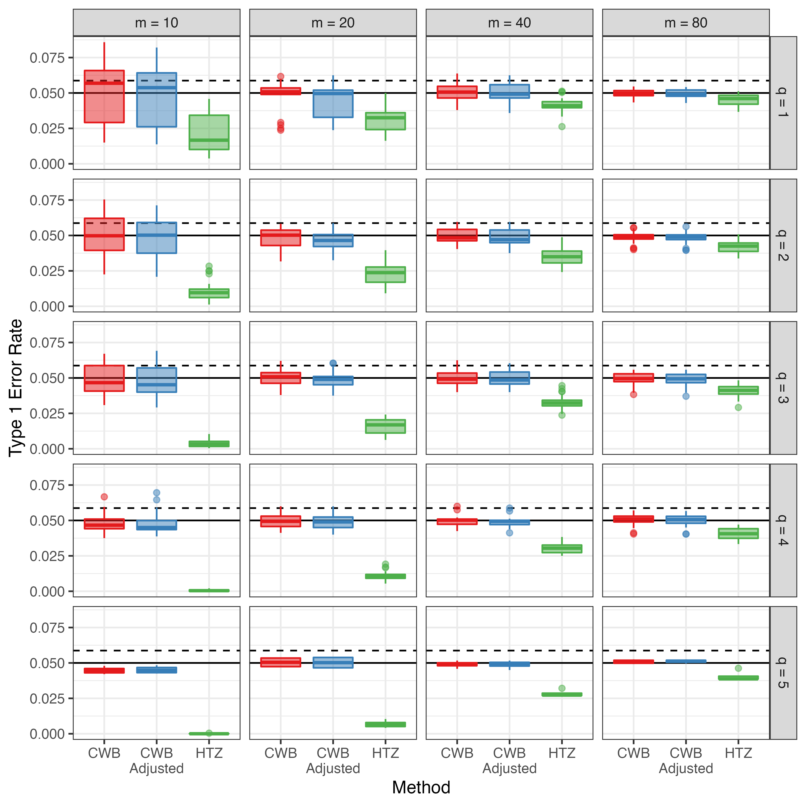

```{r xaringan-themer, include=FALSE, warning=FALSE}
library(xaringanthemer)
style_mono_accent(
  base_color = "#311432",
  header_font_google = google_font("Josefin Sans"),
  text_font_google   = google_font("Montserrat", "300", "300i"),
  code_font_google   = google_font("Fira Mono")
)

library(tidyverse)
library(knitr)
library(kableExtra)
library(simhelpers)
```


# Dependence 

- Typical meta-analytic techniques involves the assumption that effect sizes are independent 

- However, common for each primary study to yield more than one effect size or studies to be nested in some way creating dependence 
  
- Example: Tanner-Smith and Lipsey (2015) meta-analysis of the effects of brief alcohol interventions
  - 185 studies, 1446 effect sizes
  - Multiple correlated outcome measures: e.g., alcohol consumption measured by frequency of consumption, quantity consumed, blood alcohol concentration
  - Repeated measures
  - Multiple comparison groups
  
---

# Handling Dependence

- Ignore dependence 
  - Incorrect standard errors, incorrect inference from hypothesis tests
  
- Ad-hoc methods 
  - Loss of information

- Standard multivariate methods - ideal 
  - Require info on covariance between effect sizes 
  - Primary studies often don't report 


---

# Robust Variance Estimation

- Robust variance estimation (CR0-type CRVE) (Hedges, Tipton, and Johnson, 2010)

  - Rough approximate assumptions about dependence structure - sandwich estimators

  - Only works well when number of studies is large (> 40, Hedges Tipton, Johnson, 2010)
  
  - Meta-analysis in social science research typically have smaller number of studies
  
  - Small number of studies - CRVE - Type 1 error inflation - meta-analysts can conclude some effect is present when it is actually not
  
  
---

# Small Sample Corrections

- Tipton (2015) for tests of single coefficients

- Tipton and Pustejovsky (2015) for multiple-contrast hypothesis tests
  - e.g., Do effects differ across outcome measurements?

- Both recommended a method - HTZ test
  - CR2 correction method and using the Satterthwaite degrees of freedom for single coefficient tests
  - Extension of CR2 + Satterthwaite for multiple-contrast hypothesis tests

- HTZ controls Type 1 error rates adequately 

- But, low Type 1 error rates especially for __multiple-contrast hypothesis tests__ (Tipton and Pustejovsky, 2015)
  - Indicating that the test may have low power 


---


# Cluster Wild Bootstrapping (CWB)

- Alternative method - examined in the econometrics literature - not in meta-analytic framework

- Bootstrapping - estimate unknown quantities by re-sampling from original data many times (Boos et al., 2013)
  
- CWB - re-sampling residuals by multiplying them by cluster-level random weights (Cameron, Gelbach, and Miller 2008)

---

# CWB Algorithm

1. Fit a null model and a full model on the original data

2. Obtain residuals from the null model 

3. Generate an auxiliary random variable that has mean of 0 and variance of 1 and multiply the residuals by the random variable (e.g., Rademacher weights) set to be constant within clusters (CWB)
  - Can also multiply the residuals by CR2 matrices before multiplying by weights (CWB Adjusted)

4.  Obtain new outcome scores by adding the transformed residuals to the predicted values from the null model fit on the original data

5.  Re-estimate the full model with the new calculated outcome scores and obtain the test statistic

6. Repeat steps 3-5 $R$ times. Calculate p-value:

$$p = \frac{1}{R} \sum_{r = 1}^R I\left(F^{(r)} > F\right)$$

---

# Research Question

To what extent does CWB improve upon the current standard test, the HTZ test, in terms of Type I error rates and power? 


---

class: inverse, middle, center, cobBack

# Simulation Study Methods

---

# Data Generation

- Standardized mean differences

- Correlated effects meta-analytic data

- __Study 1__ covariates (will focus on this one)
  - Design matrix from Tipton and Pustejovsky (2015) 
  - Imbalanced, non-normal  covariates

- __Study 2__ covariates 
  - One covariate with 3 to 5 balanced categories 
  
---

# Estimation Methods 

- Meta-regression - correlated effects working model

- Tests:
  - Single coefficient tests
  - Multiple-contrast hypothesis tests

- Estimation methods:
  - HTZ test 
  - CWB test
  - CWB Adjusted test
  
- Number of bootstraps set to 399


---

class: inverse, middle, center, cobBack

# Results Study 1

---


# Type I Error


```{r echo = FALSE, out.height = 500, out.width = 550, fig.align = "center"}

```


---

# Relative Power


```{r echo = FALSE, out.height = 500, out.width = 400, fig.align = "center"}
knitr::include_graphics("plots/power_05_scatter.png")
```

---

# Conclusion

- Dependent effect sizes - common

- Ignore them - incorrect standard errors and inferences

- Use RVE - Type 1 error inflation - false discovery rate high

- Use small sample correction HTZ test - may miss effects that are present

- Use CWB - balances Type 1 error rates and also provides more power than existing corrections

---

# R Package

```{r echo = FALSE, out.height = 500, out.width = 650, fig.align = "center"}
knitr::include_graphics("wildmeta_hex.png")
```
[https://meghapsimatrix.github.io/wildmeta/](https://meghapsimatrix.github.io/wildmeta/)

---

class: inverse, middle, center, cobBack

# THANK YOU!

---

class: inverse, middle, center, cobBack

# Questions?

---

class: inverse

# References

Boos, D. D., & others. (2003). Introduction to the bootstrap world. Statistical Science, 18(2), 168–174. 

Cameron, A. C., Gelbach, J. B., & Miller, D. L. (2008). Bootstrap-Based Improvements for Inference with Clustered Errors. The Review of Economics and Statistics, 47.

Hedges, L. V., Tipton, E., & Johnson, M. C. (2010). Robust variance estimation in meta-regression with dependent effect size estimates. Research Synthesis Methods, 1(1), 39–65.

Joshi, M., Pustejovsky, J. E., & Beretvas, S. N. (2022). Cluster wild bootstrapping to handle dependent effect sizes in meta-analysis with small number of studies. Research Synthesis Methods. Research Synthesis Methods.

Joshi, M. & Pustejovsky, J. E (2022). wildmeta: Cluster Wild Bootstrapping for Meta-Analysis. R package version 0.2.0. https://CRAN.R-project.org/package=wildmeta

---

class: inverse

# References

Tanner-Smith, E. E., & Lipsey, M. W. (2015). Brief alcohol interventions for adolescents and young adults: A systematic review and meta-analysis. Journal of substance abuse treatment, 51, 1-18.

Tipton, E., & Pustejovsky, J. E. (2015). Small-Sample Adjustments for Tests of Moderators and Model Fit Using Robust Variance Estimation in Meta-Regression. Journal of Educational and Behavioral Statistics, 40 (6), 604–634. 

Tipton, E. (2015). Small sample adjustments for robust variance estimation with meta-regression. Psychological Methods, 20(3), 375–393. 
