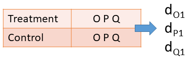
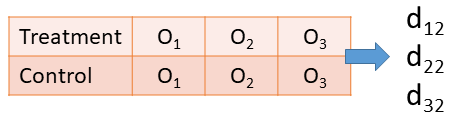
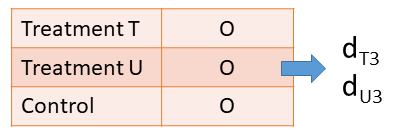
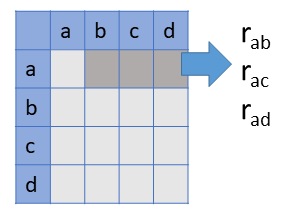

```{r xaringan-themer, include=FALSE, warning=FALSE}
library(xaringanthemer)
style_mono_accent(
  base_color = "#311432",
  header_color = '#49007c',
  header_font_google = google_font("Josefin Sans"),
  text_font_google   = google_font("Montserrat", "300", "300i"),
  code_font_google   = google_font("Fira Mono")
)

xaringanExtra::use_extra_styles(
  hover_code_line = TRUE,         #<<
  mute_unhighlighted_code = TRUE  #<<
)
xaringanExtra::use_tachyons()

library(tidyverse)
library(knitr)
library(kableExtra)
library(wildmeta)

opts_chunk$set(echo = FALSE)
```

## Selective reporting of study results

- __Selective reporting__ occurs if _affirmative_ findings are __*more likely to be reported*__ and available for inclusion in meta-analysis.

    - _Affirmative_ meaning __statistically significant__ and __in the theoretically expected direction__. 
    
    - Bias in the publication process (journal/editor/reviewer incentives)
    
    - Strategic decisions by authors

--

.fl.w-60[
- Selective reporting __distorts the evidence base__ available for systematic review/meta-analysis.

  - Inflates average effect size estimates from meta-analyses.
  
  - Biases estimates of heterogeneity ([Augusteijn et al., 2019](https://doi.org/10.1037/met0000197)).
]

.fl.w-40[
```{r}

```

]

---

## Tools for investigating selective reporting

.pull-left[

- Graphical diagnostics

    - Funnel plots
    - Contour-enhanced funnel plots
    - Power-enhanced funnel plots (sunset plots)


```{r, out.width = "100%"}

```

]

.pull-right[
    
- Tests/adjustments for funnel plot asymmetry
    
    - Trim-and-fill
    - Egger's regression
    - PET/PEESE
    - Kinked meta-regression

- Selection models

    - Weight-function models
    - Copas models
    - Sensitivity analysis
    
- p-value diagnostics

    - $p$-curve
    - $p$-uniform / $p\text{-uniform}^*$

]    

---


## Selection models

--

- Model describing the __evidence generation process__

  - Random effects meta-regression

--

- Model describing the __process by which evidence is reported__

  - Vevea-Hedges step-function (Vevea & Hedges, 1995)
  
  - Probability that an effect size estimate is observed depends on the range in which its p-values falls 
        
        
        
---

## Dependent effect size estimates

.pull-left[

__Multiple outcomes measured on a common set of participants__
```{r, out.width = "100%"}

```
]

.pull-right[
__Outcomes measured at multiple follow-up times__
```{r, out.width = "100%"}

```
]

.pull-left[

__Multiple treatment conditions compared to a common control__

```{r, out.width = "100%"}

```

]

.pull-right[

__Multiple correlations from a common sample__

```{r, out.width = "80%"}

```
]

---

## Motivation

--

-   Methods to examine and account for selective outcome reporting bias, such as selection models, __cannot currently account for effect size dependency__

--

-   But dependent effect sizes are __ubiquitous__ in education and social science meta-analyses

--

-   Failing to account for dependency can result in __misleading conclusions__ like inflated Type 1 error rates, and too-narrow confidence intervals

---

## Our Project

--
-   Develop and examine __better methods__ for investigating and accounting for selective reporting in meta-analysis

--

-   Account for __dependent effect sizes__

--

-   Combine selection models with
  
  -   Cluster bootstrap (preliminary work)
  -   Cluster robust variance estimation (CRVE; on-going work)
    
---

## Motivation to Cluster Bootstrap

--

-   Bootstrapping involves emulating unknown distributions by __re-sampling from original__ data many times

--

-   Can __re-sample clusters__ of dependent effect sizes to address dependence

--

-   Bootstrapping

    -   Can be implemented with off-the-shelf tools

    -   Bootstrap is closely related to CRVE, so it provides initial evidence of how CRVE inference may perform
    
---

## Cluster Bootstrap with Selection Models

--

-   Estimate a regular one-level three-parameter selection model

--

-   Use a cluster bootstrap (re-sampling of clusters of dependent effect sizes) to assess uncertainty


---

class: inverse, middle, center, cobBack

# Simulation Study

---

## Data Generation

--

-   Mostly follows Rodgers & Pustejovsky (2020)

--

-   Generated summary statistics for __correlated outcomes__ for two-group comparison designs (equal sample size)

--

-   Generated meta-analytic dataset with sample size and number of effect sizes sampled from distributions found in WWC studies database

--

-   Censored one-sided p-values \> 0.025 with __specified probability of selection__

--

-   Continued sampling until dataset included effect sizes from $m$ studies

---

## Estimation

--

-   Cluster bootstrap selection model 

    -   Run meta-regression using `metafor::rma.uni()`

    -   Fit selection model using `metafor::selmodel()`

    -   Re-sample dependent clusters using `boot` package and custom code

    -   Fit selection model on the re-sampled data

--

-   Compare cluster bootstrapping to:

    -   Correlated and hierarchical effects model

    -   Fixed effects model with correlated sampling errors but no random effects

    -   PET/ PEESE
    
---

# Experimental Design

```{r echo = F, warning = F, message = F}
library(tidyverse)

exp_design <- 
  tibble(Conditions = c("Overall average SMD ($\\mu$)",
                        "Between-study heterogeneity ($\\tau$)",
                        "Average Correlation between outcomes ($\\rho$)",
                        "Weights for censoring (probability of selection for non-significant ES",
                        "Number of studies ($m$)"),
         Values = c("0, 0.25, 0.75",
                    "0, 0.3 0.6",
                    "0.4, 0.8",
                    "0.2, 0.5, 1",
                    "30, 60, 90")
    
  )

exp_design %>%
  kbl() %>%
  kable_classic(full_width = F, html_font = "Cambria")
```

Initial simulations used 500 replications for each simulation condition, with 399 bootstrap for each replication. 


